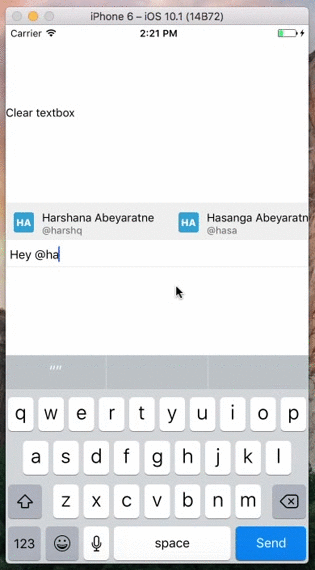

# react-native-mentions [](https://badge.fury.io/js/react-native-mentions)
Mentions textbox for React Native. Works on both ios and android. 



## Installation

```
npm install --save react-native-mentions
```

## Usage

```js
import {MentionsTextInput} from 'react-native-mentions';

<MentionsTextInput
 placeholder={'Write a mention...'} // defaults to 'Write a comment...'
 textInputStyle={{ borderColor: '#ebebeb', borderWidth: 1, padding: 5, fontSize: 15 }}
 textInputMinHeight={35}
 textInputMaxHeight={85}
 returnKeyType={'send'}
 trigger={'@'}
 triggerLocation={'new-word-only'} // 'new-word-only', 'anywhere'
 value={this.state.value}
 onChangeText={(val) => { this.setState({ value: val }) } }
 suggestionsPanelHeight={45}
 renderSuggestionsRow={this.renderSuggestionsRow.bind(this)}
 suggestionsPanelStyle={{ backgroundColor: 'rgba(100,100,100,0.1)' }}
 suggestionsDataSource={this.state.ds}
 triggerCallback={this.callback.bind(this)}
 onKeyPress={(e) => { e.nativeEvent.key == "Enter" ? console.log("ENTER") : false } } 
/>
```

## Example 

Check full example in the `sampleApp` folder. 

## License

[MIT License](http://opensource.org/licenses/mit-license.html). © Harshana Abeyaratne
