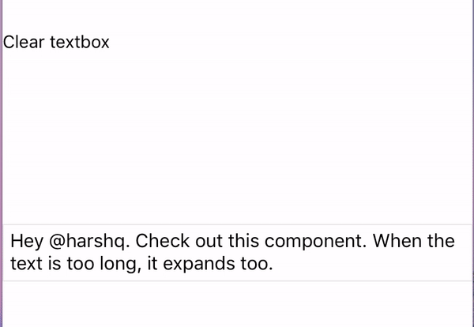
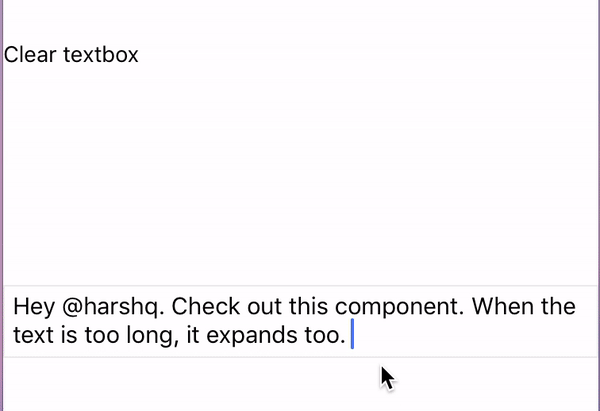

# react-native-mentions [](https://badge.fury.io/js/react-native-mentions)
Mentions textbox for React Native. Works on both ios and android. 

## Demo




## Installation

```yarn add react-native-mentions```
or
```npm install --save react-native-mentions```

## Usage

```js
import {MentionsTextInput} from 'react-native-mentions';

  <MentionsTextInput
    textInputStyle={{ borderColor: '#ebebeb', borderWidth: 1, padding: 5, fontSize: 15 }}
    suggestionsPanelStyle={{ backgroundColor: 'rgba(100,100,100,0.1)' }}
    loadingComponent={() => <View style={{ flex: 1, width, justifyContent: 'center', alignItems: 'center' }}><ActivityIndicator /></View>}
    textInputMinHeight={30}
    textInputMaxHeight={80}
    trigger={'@'}
    triggerLocation={'new-word-only'} // 'new-word-only', 'anywhere'
    value={this.state.value}
    onChangeText={(val) => { this.setState({ value: val }) }}
    triggerCallback={this.callback.bind(this)}
    renderSuggestionsRow={this.renderSuggestionsRow.bind(this)}
    suggestionsData={this.state.data} // array of objects
    keyExtractor={(item, index) => item.UserName} 
    suggestionRowHeight={45}
          
    horizontal={false} // defaut is true, change the orientation of the list
    MaxVisibleRowCount={3} // this is required if horizontal={false}
  />
```

## Example 

Check full example in the `sampleApp` folder. 

## Breaking changes ( 0.0.4 -> 1.1.1 )

- This library now supports RN 0.47 and above due to [this](https://github.com/facebook/react-native/commit/bac84ce207a0466cec95626131063751eb48b964). If you're on a older version, use react-native-mentions 0.0.4.

- `SuggestionsDataSource` prop is renamed to `suggestionsData`. This now accepts a array of objects. DataSource, No more!

- `SuggestionsPanelHeight` prop is renamed to `suggestionRowHeight` in order to support vertical lists. 


## License

[MIT License](http://opensource.org/licenses/mit-license.html). © Harshana Abeyaratne
